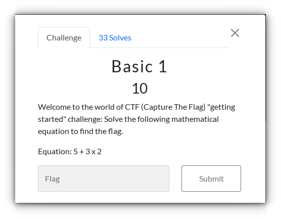
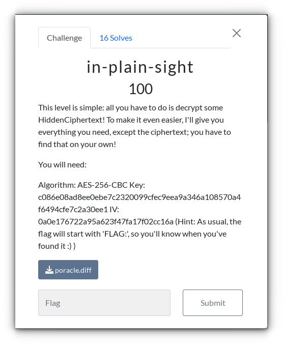
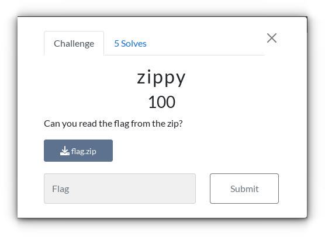
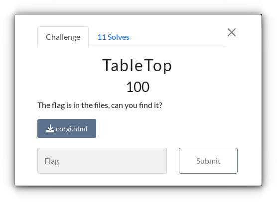
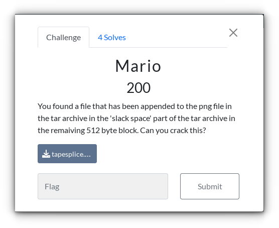

:toc:
:toc-title: SOA CTF 2024 - solutions
:sectnums:
ifdef::env-github[]
:important-caption: :information_source:
:note-caption: :bulb:
endif::[]

= SOA CTF 2024 - solutions

Solutions for the CTF challenge during Cybersecurity month, October 2024.

== Challenge 1: Basic 1

=== Solution

In this basic challenge, the order of operation (point calculation before line calculation) must be followed to solve the equation.

The solution is: `11`

== Challenge 2: In Plain Sight

=== Solution

Based on the challenge text and the provided assistance

> all you have to do is decrypt some HiddenCiphertext! +
> … +
> Algorithm: AES-256-CBC …

One might think that this is a decrypting task.
Check the file type of the file `poracle.diff`.

[source=shell]
----
$ file poracle.diff
poracle.diff: unified diff output text …
----

As it is identified as some text file, it can be opened in an editor

[source=text]
----
diff --git a/Demo.rb b/Demo.rb
index d38db66..27f6e73 100644
--- a/Demo.rb
+++ b/Demo.rb
…
----

Depending on the first lines, it seems to be Git diff, rather than something that needs to be decrypted.

The challenge text had an additional hint.

> Hint: As usual, the flag will start with 'FLAG:', so you'll know when you've found it :)

Searching in the file for the text `FLAG`, find this line:

[source=text]
----
+data = "FLAG:1d010f248d"
----

The solution is: `FLAG:1d010f248d`

== Challenge 3: Zippy

=== Solution

Assuming the file is a Zip archive, check the file with `zipinfo`:

[source=shell]
----
$ zipinfo -v flag.zip

…

Central directory entry #1:
---------------------------

  flag.txt

  offset of local header from start of archive:   0
                                                  (0000000000000000h) bytes
  file system or operating system of origin:      Unix
  version of encoding software:                   3.0
  minimum file system compatibility required:     MS-DOS, OS/2 or NT FAT
  minimum software version required to extract:   2.0
  compression method:                             deflated
  compression sub-type (deflation):               normal
  file security status:                           encrypted
  extended local header:                          yes
  file last modified on (DOS date/time):          2019 Mar 2 12:34:28
  file last modified on (UT extra field modtime): 2019 Mar 2 21:34:28 local
  file last modified on (UT extra field modtime): 2019 Mar 2 20:34:28 UTC
  32-bit CRC value (hex):                         822cd691
  compressed size:                                37 bytes
  uncompressed size:                              28 bytes
  length of filename:                             8 characters
  length of extra field:                          24 bytes
  length of file comment:                         0 characters
  disk number on which file begins:               disk 1
  apparent file type:                             text
  Unix file attributes (100664 octal):            -rw-rw-r--
  MS-DOS file attributes (00 hex):                none

  The central-directory extra field contains:
  - A subfield with ID 0x5455 (universal time) and 5 data bytes.
    The local extra field has UTC/GMT modification/access times.
  - A subfield with ID 0x7875 (Unix UID/GID (any size)) and 11 data bytes:
    01 04 e8 03 00 00 04 e8 03 00 00.
----

It reveals the Zip archive contains a file `flag.txt`, and that the archive is encrypted.

As the Zip file and the challenge itself don’t contain additional hints for the password, we can only try to guess it.

There are two common solutions to achieve it:

* by brute force: try all possible combinations of characters, numbers, and symbols
* using a dictionary: a dictionary is a wordlist of common or leaked passwords

As we don't have any hints about the password length, brute force might take ages to find the correct password.
Hence, using a dictionary most probably will find the password faster.

In July 2024, a wordlist containing around 10 billion passwords was leaked.
The wordlist is available on the internet, and it is known as "RockYou2024".

There are different tools to crack passwords.
One popular tool for this task is `John the Ripper`.

It requires a hash to crack the password.
To compute the hash from the Zip file the tool `zip2john` is used.

[source=shell]
----
$ zip2john flag.zip > flag.hash
----

Now that we have the hash we can run `John the Ripper` (JtR) with the "RockYou2024" wordlist.

[source=shell]
----
$ john --wordlist=rockyou2024.txt --format=PKZIP --pot=flag.pot flag.hash
Using default input encoding: UTF-8
Loaded 1 password hash (PKZIP [32/64])
Will run 16 OpenMP threads
Note: Passwords longer than 21 [worst case UTF-8] to 63 [ASCII] rejected
Press Ctrl-C to abort, or send SIGUSR1 to john process for status
0g 0:00:01:51 23.58% (ETA: 08:45:51) 0g/s 15089Kp/s 15089Kc/s 15089KC/s …
----

JtR tries 15.089.000 passwords per second.
Around nine minutes later … the password wasn't found.

So we need another strategy for the dictionary.
The idea is to use a smaller dictionary, which contains common English words, and use permutations of these words.

The common English words are taken from https://www.ef.com/wwen/english-resources/english-vocabulary/top-3000-words, and are stored in the file `3000-most-common-words-in-English`.

Checking the file its to notice that it missed the word `password` itself.
The RockYou2024 wordlist contains 422.379 passwords which contain the part `password` literally.

There are the following additional assumptions made:

* a password contains only lowercase characters
* a password doesn't contain numbers or special characters
* a password is a combination of different words

For the password checking, I wrote two scripts.

* link:resources/zippy-solution.py[zippy-solution.py] which generated the permutations and write it in chunks to a file
* link:resources/run-jtr.sh[run-jtr.sh] which runs JtR for each generated chunk

The first iteration was to generate passwords as permutation of two words.

[source=shell]
----
$ ./zippy-solution.py
[*] Characters in the wordlist file: 22,224
[*] Add 'password' to wordlist
[*] Number of words: 3,001
[*] Shuffle wordlist
[*] Words per permutation: 2
[*] Number of permutations: 9,003,000
[*] Estimated size of permutation wordlist: ~ 133,392,000 bytes
[*] Start writing permutation wordlist part #0
[+] Finished writing permutations to file - Duration: 0:00:11.272947
[*] Start cracking part #0
[*] Start writing permutation wordlist part #1
[+] Finished writing permutations to file - Duration: 0:00:00.013289
[-] Password was not found
[*] Duration: 0:00:11.326028
----

The second iteration was to generate passwords as permutation of three words.

[source=shell]
----
$ ./zippy-solution.py
[*] Characters in the wordlist file: 22,224
[*] Add 'password' to wordlist
[*] Number of words: 3,001
[*] Shuffle wordlist
[*] Words per permutation: 3
[*] Number of permutations: 26,999,997,000
[*] Estimated size of permutation wordlist: ~ 600,063,912,000 bytes
[*] Start writing permutation wordlist part #0
[+] Finished writing permutations to file - Duration: 0:00:58.501612
[*] Start cracking part #0
[+] Password found - check the flag.pot file
[*] Duration: 0:00:58.862437
----

JtR found the password in the current chunk of permutation wordlist.
Now we can check for the discovered password in the file `flag.pot`.

[source=shell]
----
$ john --show --pot=flag.pot flag.hash
flag.zip/flag.txt:supercomplexpassword:flag.txt:flag.zip::…
----

The password needed to extract the file `flag.txt` from the Zip archive is `supercomplexpassword`.

[source=shell]
----
$ unzip flag.zip
Archive:  flag.zip
[flag.zip] flag.txt password:
  inflating: flag.txt
----

The file `flag.txt` contains the solution: `CTF{this_flag_is_your_flag}`.

== Challenge 4: TableTop

=== Solution

When open the file `corgi.html` in an editor it looks like an HTML file with a JavaScript part.
So open the file in a browser.

The browser shows:

> CTF{JustAS0ngAb0utP1ngP0ng}
>
> Woof!!

The solution is: `CTF{JustAS0ngAb0utP1ngP0ng}`

== Challenge 5: Mario

=== Solution

Check the file type of file `tapesplice.tar`.

[source=shell]
----
$ file tapesplice.tar
tapesplice.tar: POSIX tar archive (GNU)
----

It's an uncompressed tar archive.

The challenge mentions that a file is appended "in the 'slack space' part" of the tar archive.

To solve the challenge, we need to know some basics of the tar archive format.

Simplified, it can be summarized as follows:

* a tar archive consists of a series of file entries
* each entry consists of a header, and the content
* header and content are stored in blocks of 512 bytes

If the file content is not a multiple of 512 bytes, the last block contain bytes which don't belong to the file content (that is the mentioned slack space).

As the appended file is stored in the slack space we can compute its offset as "length_header + length_content_file".

The content file length can be retrieved as:

[source=shell]
----
$ tar --verbose --list --file tapesplice.tar
-rw-r--r-- brenrigh/brenrigh 128623 2021-03-05 09:22 thankyou_noflag.png
----

So we have the following values:

* the length of the header: 512 bytes (it is always one block)
* the length of content file: 128623 bytes

The slack space offset can be computed as: `512 + 128623 = 129135`.

Now we can extract the bytes starting from offset `129135` into a new file.

[source=shell]
----
$ dd if=tapesplice.tar skip=1 bs=129135 of=appended_file
----

This command uses `tapesplice.tar` as the input file, skips the first `129135 bytes`, and writes the remaining bytes into the file `appended_file`.

Checking the file type of the created file `appended_file`.

[source=shell]
----
$ file appended_file
appended_file: bzip2 compressed data, block size = 900k
----

It is recognized as bzip2 compressed data. So we can try to decompress it

[source=shell]
----
$ bzip2 --quiet --decompress < apppended_file
CTF{everything_has_space_for_hidden_data}
----

The solution is: `CTF{everything_has_space_for_hidden_data}`
